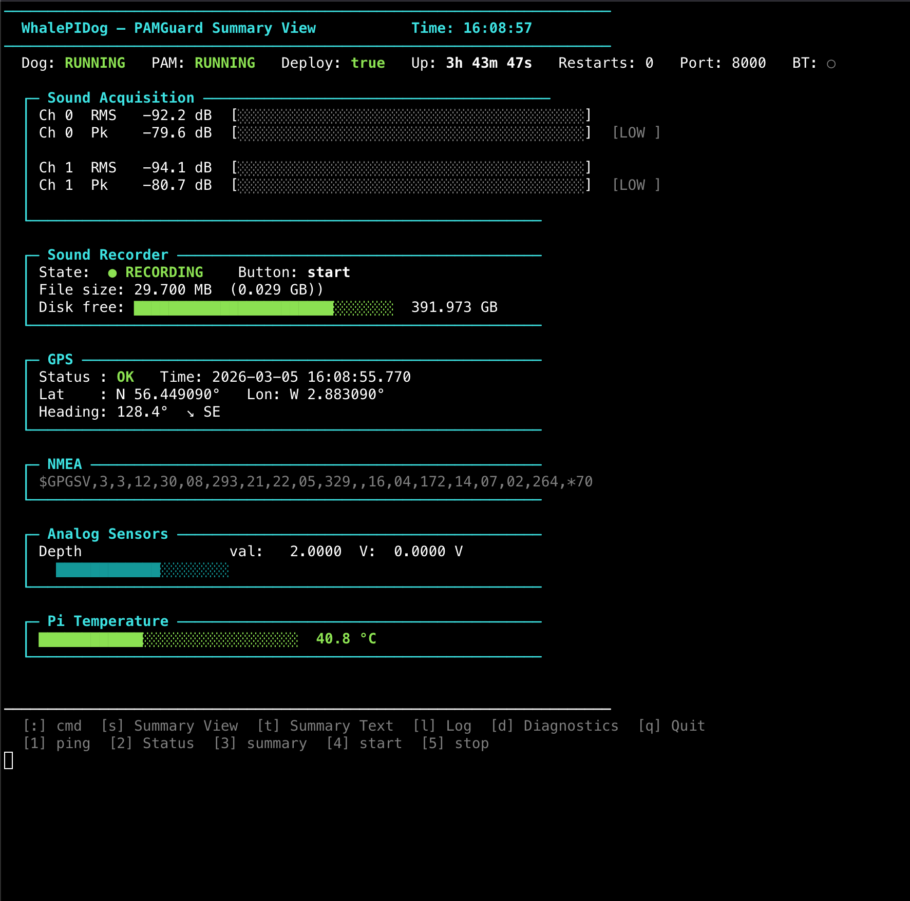
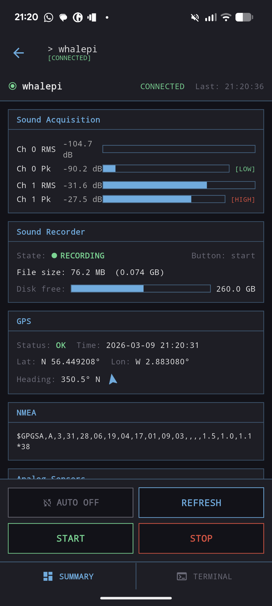

# WhalePi

##
Welcome to WhalePi, a flexible passive acoustic recording and real-time analysis system based on a Raspberry Pi Zero and [PAMGuard](www.pamguard.org). The aim of WhalePi is to create a flexible medium-power recording system for cetaceans. Cetaceans cover over twelve octaves, from the 100Hz calls of Blue Whales to the 130,000 Hz clicks of Kogia and porpoises, with some broadband click components going even higher in frequency. This means any recording system to cover all species needs to have both a high dynamic range (i.e., 24-bit), a high sample rate (i.e. 384,000 kS/s), and ideally multiple channels. WhalePi provides a solution to create such a system by running PAMGuard software on low-cost hardware, particularly a COSMOS DAQ card and Raspberry Pi Zero 2 W. 

PAMGuard is a highly flexible modular programme enabling users to create an acoustic workflow for real-time analysis.  It also integrates with various hardware like sound cards and GPS. WhalePi facilitates setting up a PAMGuard configuration and running it on a Raspberry Pi.  While most modern Raspberry Pi boards work, WhalePi is optimised for the Raspberry Pi Zero 2 W, which has medium power consumption. This allows for autonomous deployment for days or weeks on a large 12V battery or solar panels.  The Raspberry Pi supports up to 1TB of storage for recordings or detection. For instance, the system could save only PAMGuard’s automated click detector output, effectively unlimited storage.  

The COSMOS sound card connects to the Raspberry Pi and drivers have been developed to run it efficiently through PAMGuard.  This allows for 24-bit recordings with high dynamic range.  The sound card can manage stereo channels at a 384 kHz sample rate per channel covering all cetacean species provided a hydrophone with a suitable frequency response is used.  GPS and analogue sensors for depth and temperature can also be integrated. 

WhalePi  does not come with plans for an  housing but the COSMOS sound card and Raspberry Pi are relatively compact.  They can be mounted inside a small Peli Case or underwater housing like those made by [BlueRobotics](https://bluerobotics.com/).  This potentially allows you to create an advanced PAM system for under $500. While WhalePi won’t replace devices like SoundTraps or CPODs it’s useful for situations where flexibility cost and/or real-time communication are important. 

---

## How WhalePi works (high level)

WhalePi is essentially:
- A Raspberry Pi running **PAMGuard** (the analysis engine)
- A high performance audio front-end (COSMOS DAQ) for **24-bit** recording at high sample rates
- A **watchdog script** that starts and monitors PAMGuard, and (optionally) exposes status/control over Bluetooth for use with a phone app

Typical workflows include:
- **Record raw audio** for later analysis
- **Run real-time detection** (e.g., click detection) and only save detections/summary products to reduce storage usage
- **Log metadata** (GPS, depth, temperature) alongside audio/detections

---

## What you need

### Recommended hardware
- **Raspberry Pi Zero 2 W** (WhalePi is optimised for this board)
- **COSMOS DAQ** audio interface / sound card
- **Hydrophone** suitable for your target species and frequency range
- **Storage**: microSD / USB storage (up to 1TB supported by the Pi)
- **Power**: a stable 5V supply for bench testing, and a **12V battery** or **solar + battery** system for field deployments

### Optional hardware
- **GPS** (for timestamped position logging)
- **Analogue / I2C sensors** such as depth and temperature

---

## Installing WhalePi

### **Prepare the Raspberry Pi**

  Follow the setup instructions in [install.md](https://github.com/WhalePi/install_whalepi/blob/main/install.md) to install prerequisites and PAMGuard (Java 21, Bluetooth support, tmux, etc.) and configure the Pi.
  
### **Start WhalePi**

From inside the directory `/home/whalepi/pamguard_pizero`, start WhalePi using the watchdog script:

```bash
  ./whalepidog_pizero_tmux.sh`
```
Nothing will happen in terminal - pamguard has been started in the background.
 
### **Set PAMGuard to start automatically**
   
Navigate the `/home/whalepi/pamguard_pizero/utils` and run the background installer

```bash
install_whalepidog_service.sh`
```

PAMGuard will now start running whenever the Raspberry Pi Zero powers on.
 
> Tip: [troubleshoot.md](https://github.com/WhalePi/install_whalepi/blob/main/troubleshoot.md) has some handy tips for troubleshooting

---

## Running and controlling WhalePi

PAMGuard launched inside a **tmux** session so it continues running after you disconnect from SSH or end the terminal session. There are three ways to interact with PAMGaurd. 

### Use terminal

Attach a keyboard and monitor the to RaspberryPi Zero. Login using the username `whalepi` and the correct password. Then reattach the PAMGuard seeions 

`tmux attach -t pamguard`

This will bring up the ternimal interface.

<p align="center">
  
</p>


When connected to the running session, you can use commands like:
- `start` – begins audio processing
- `stop` – pauses/ends audio processing
- `summary` – displays current stats
- `status` – checks whether PAMGuard is running (1) or not (0)

For the full command set see the PAMGuard UDP command documentation:
https://github.com/PAMGuard/PAMGuard/wiki/UDP-Commands

Detach without stopping (inside tmux):

`Ctrl+B` then `D`


### Use Raspberry Pi Connect (remote access)**

[Raspberry Pi Connect](https://www.raspberrypi.com/software/connect/) provides a remote way to access the Pi without physically attaching a display: All other functions are exactly as terminal above. 

> Note: Raspberry Pi Connect is super handy because you can access a RaspberryPi from any computer, however it requires an internet connect. To connect the Raspberry Pi to the internet use `raspi-config` to configure WiFi. 

### Use the WhalePi phone app

The WhalePi phone app is intended for field convenience: checking system status, viewing detections/summary information, and issuing start/stop/status actions without a laptop. It also has some functionaility to allow copying of data from the pi to a hard drive. 

<p align="center">
  
</p>


Go to the **Releases** section of this repository to find app availability and installation notes (if published alongside the WhalePi release package).

> Note: Bluetooth setup (BLE / legacy serial) is described in `install.md`. Ensure Bluetooth is configured before relying on the phone app.

---

## Where outputs are stored (general guidance)

Exact output paths depend on your PAMGuard configuration, but in general you should expect:
- **Raw audio** (if enabled): stored on the Pi’s configured storage location
- **Detector outputs** (e.g. clicks): stored as PAMGuard data products (often much smaller than raw audio)
- **Logs / status**: produced by the watchdog and/or PAMGuard

If you change the PAMGuard configuration, confirm output directories and available disk space before deployment.

## Changing WhalePi Settings

WhalePi is based on PAMGuard so the easiest way to change settings is to use a different .psfx PAMGuard settings file. The best way to do this is to build and test the .psfx on a Raspberry Pi 4 or 5. These can run the full graphical user interface version of PAMGuard and you can exactly replicate most of hardware on the RaspberryPi Zero. Once you are happy with the .psfx file save to the `/home/whalepi/pamguard_pizero` folder. Next we will need to change the settings of the watchdog to tell it to open the correct .psfx files. Open the `watchdog_settngs.json` file on the RaspberyPi Zero using

```bash
cd /home/whalepi/pamguard_pizero
sudo nano watchdog_settngs.json
```
This will bring up the watchdog settings in  basic terminal word processor. 

```json
{
   "daemon": true,
    "pamguardJar": "/home/whalepi/pamguard_pizero/Pamguard-2.02.18a.jar",
    "startWaitSeconds": 40,
    "bluetoothSettings": {
        "bluetoothPairing": true,
        "bluetoothEnabled": true,
        "identification": "1A",
        "bluetoothMode": "BLE",
        "verbose": true
    },
    "psfxFile": "/home/whalepi/pamguard_pizero/pamguard_pizero_nogui.psfx",
    "otherOptions": "",
    "udpPort": 8000,
    "libFolder": "liblinux",
    "otherVMOptions": "",
    "checkIntervalSeconds": 30,
    "deploy": true,
    "summaryIntervalSeconds": 5,
    "workingFolder": "",
    "database": "/home/whalepi/whalepi_database.sqlite3",
    "msMemory": 100,
    "wavFolder": "/home/whalepi/PAMRecordings",
    "recordingPrefix": "PAM1A",
    "soundCardName": "",
    "noGui": true,
    "jre": "java",
    "mxMemory": 500
}
```

Change the `psfxFile` field to the name of your new .psfx file. The other settings fields are described in this document. 

## Deployment checklis

Before leaving the bench:
- Confirm audio input is working (hydrophone + COSMOS DAQ). Use the 
- Confirm correct sample rate and channel count
- Confirm outputs are being written where you expect
- Confirm time sync (and GPS if used)
- Confirm power budget and storage budget for the planned duration
- Confirm remote access method (monitor, Raspberry Pi Connect, and/or phone app)
- If using sensors (depth/temp), confirm I2C is enabled and sensors are logging

---

## Development

This repository focuses on installation and setup for WhalePi on the Raspberry Pi.

If you are contributing:
- Keep changes small and testable
- Update docs alongside any changes to install/run scripts
- Document hardware assumptions (Pi model, DAQ version, sensors)
